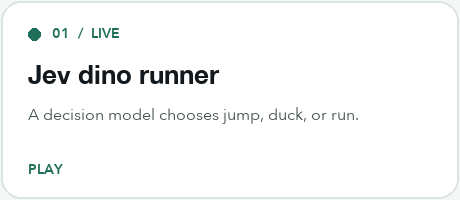
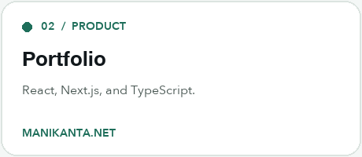
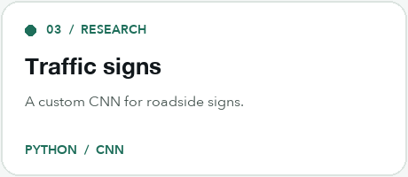
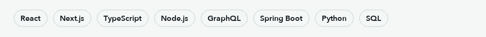
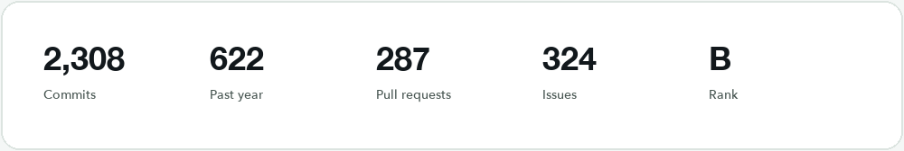
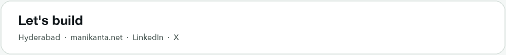

<picture>
  <source media="(prefers-color-scheme: dark)" srcset="assets/hero-dark.gif">
  
</picture>

<picture>
  <source media="(prefers-color-scheme: dark)" srcset="assets/typing-dark.gif">
  
</picture>

I build product interfaces with React, Next.js, and TypeScript, and the APIs behind them with Node.js, Spring Boot, and GraphQL. I work at Analytica Enterprise Solutions in Hyderabad. From November 2022 to March 2023 I interned at Inflolabs on the Revidd platform.

### Featured

  <a href="https://jev-dino-runner.run.dflow.sh">
    <picture>
      <source media="(prefers-color-scheme: dark)" srcset="assets/dino-dark.png">
      
    </picture>
  </a>
  <a href="https://manikanta.net">
    <picture>
      <source media="(prefers-color-scheme: dark)" srcset="assets/portfolio-dark.png">
      
    </picture>
  </a>

  <a href="https://github.com/manikanta9176/traffic-sign-detection">
    <picture>
      <source media="(prefers-color-scheme: dark)" srcset="assets/signs-dark.png">
      
    </picture>
  </a>

**[Jev dino runner](https://jev-dino-runner.run.dflow.sh)** — play the live build, or read the [source](https://github.com/manikanta9176/jev-dino-runner).

**[Portfolio](https://manikanta.net)** — [source](https://github.com/manikanta9176/portfolio).

**[Traffic-sign detection](https://github.com/manikanta9176/traffic-sign-detection)** — a custom CNN. The same period includes disease classification with an SVM, drug recommendation from review sentiment, and a term paper on fake-profile detection.

### Stack

<picture>
  <source media="(prefers-color-scheme: dark)" srcset="assets/stack-dark.png">
  
</picture>

Also Strapi, Hasura, Tailwind, Redux, PostgreSQL, MongoDB, and Java. CodeChef peak rating **1551**. Fourth place in the ACM GMRIT monthly Codethon, 2021.

### Stats

<picture>
  <source media="(prefers-color-scheme: dark)" srcset="assets/stats-dark.png">
  
</picture>

  

### Connect

<picture>
  <source media="(prefers-color-scheme: dark)" srcset="assets/connect-dark.png">
  
</picture>

[manikanta.net](https://manikanta.net) · [LinkedIn](https://www.linkedin.com/in/manikantapotnuru/) · [X](https://x.com/manikanta9176) · [Email](mailto:manikantapotnuru9176@gmail.com)
