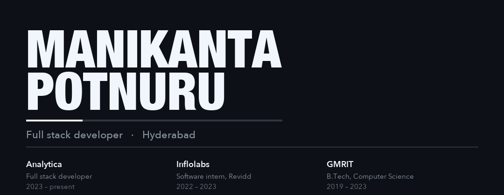

[manikanta.net](https://manikanta.net) · [LinkedIn](https://www.linkedin.com/in/manikantapotnuru/) · [X](https://x.com/manikanta9176) · [Email](mailto:manikantapotnuru9176@gmail.com)

I build product interfaces with React, Next.js, and TypeScript, and the APIs behind them with Node.js, Spring Boot, and GraphQL. I work at Analytica Enterprise Solutions in Hyderabad. From November 2022 to March 2023 I interned at Inflolabs on the Revidd platform: Spring Boot, MongoDB, GraphQL, and the bugs behind the API.

I studied computer science at GMR Institute of Technology. CodeChef peak rating **1551**. Fourth place in the ACM GMRIT monthly Codethon, 2021.

## Work

**[Portfolio](https://manikanta.net)**
The public site, built as a product story in React, Next.js, and TypeScript. [Source](https://github.com/manikanta9176/portfolio)

**[Jev dino runner](https://jev-dino-runner.run.dflow.sh)**
A dinosaur runner. A decision model chooses jump, duck, or run from the game state and a short forecast. The API key stays on the server. [Source](https://github.com/manikanta9176/jev-dino-runner)

**[Traffic-sign detection](https://github.com/manikanta9176/traffic-sign-detection)**
A custom CNN for roadside signs. The same period includes a disease classifier using an SVM, a drug recommendation project based on review sentiment, and a term paper on fake-profile detection.

## Stack

React · Next.js · TypeScript · JavaScript · Node.js · GraphQL · Spring Boot · Java · Python

SQL · PostgreSQL · MongoDB · Tailwind · Redux · Strapi · Hasura · Chakra UI · Firebase · Supabase

Also C and C++. Coursework in data structures, object-oriented programming, and databases. Courses: Data Science in Python (University of Michigan, Coursera), Data Structures and Algorithms using Java (Infosys Springboard), Introduction to Programming using Python (Microsoft Technology Associate), and GraphQL with Java Spring Boot (Udemy).

## GitHub

Open to full-stack product work, React and Next.js builds, and teams that care how the product feels and how it ships.
