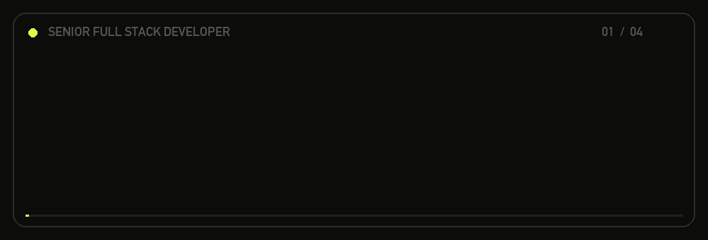
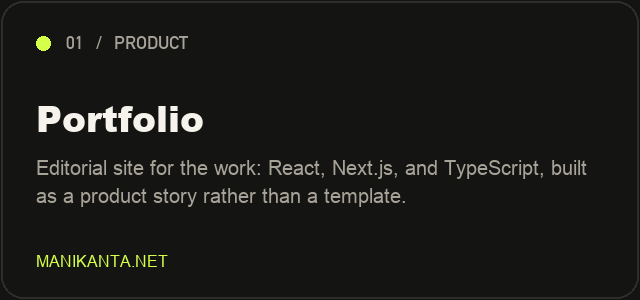
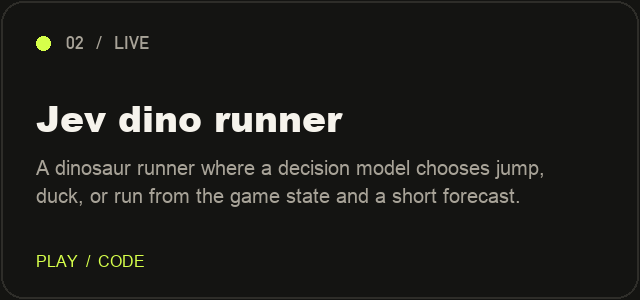
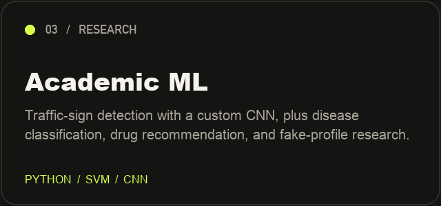
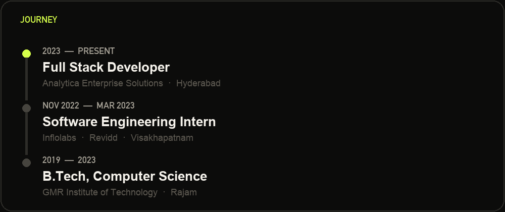

[manikanta.net](https://manikanta.net) · [LinkedIn](https://www.linkedin.com/in/manikantapotnuru/) · [X](https://x.com/manikanta9176) · [Email](mailto:manikantapotnuru9176@gmail.com)

## About

I am Manikanta Potnuru, a full stack developer in Hyderabad. I build product interfaces with React, Next.js, and TypeScript, and the APIs behind them with Node.js, Spring Boot, and GraphQL.

I work at Analytica Enterprise Solutions, across UI, web platforms, and deployment-ready product work. From November 2022 to March 2023 I interned at Inflolabs on the Revidd platform: Spring Boot, MongoDB, GraphQL, scalable APIs, and backend bugs. I earned a B.Tech in Computer Science and Engineering from GMR Institute of Technology, Rajam (2019–2023).

CodeChef peak rating **1551**. Fourth place in the ACM GMRIT monthly Codethon, 2021.

## Work

<table>
<tr>
<td width="50%">

</td>
<td width="50%">

</td>
</tr>
</table>

**Portfolio.** The public site at [manikanta.net](https://manikanta.net). [Source](https://github.com/manikanta9176/portfolio).

**Jev dino runner.** The browser draws the game. A decision model picks jump, duck, or run from the current state and a short physics forecast, and the API key stays on the server. [Play](https://jev-dino-runner.run.dflow.sh) · [Source](https://github.com/manikanta9176/jev-dino-runner)

**Academic ML.** [Traffic-sign detection](https://github.com/manikanta9176/traffic-sign-detection) uses a custom CNN. The same period includes a disease classifier built with an SVM, a drug recommendation project that reads review sentiment, and a term paper on fake-profile detection.

## Journey

| When | Role | Where |
| --- | --- | --- |
| 2023 – present | Full Stack Developer | Analytica Enterprise Solutions, Hyderabad |
| Nov 2022 – Mar 2023 | Software Engineering Intern | Inflolabs · Revidd, Visakhapatnam |
| 2019 – 2023 | B.Tech, Computer Science and Engineering | GMR Institute of Technology, Rajam |

## Stack

Also in the work: Strapi, Hasura, Chakra UI, C, and C++. Core coursework covered data structures, object-oriented programming, and databases.

Courses I finished: Data Science in Python (University of Michigan, Coursera), Data Structures and Algorithms using Java (Infosys Springboard), Introduction to Programming using Python (Microsoft Technology Associate), and GraphQL API with Java Spring Boot (Udemy).

## GitHub

The snake is redrawn from the contribution graph on a daily schedule.

Open to full-stack product work, React and Next.js builds, and teams that care how the product feels and how it ships.
